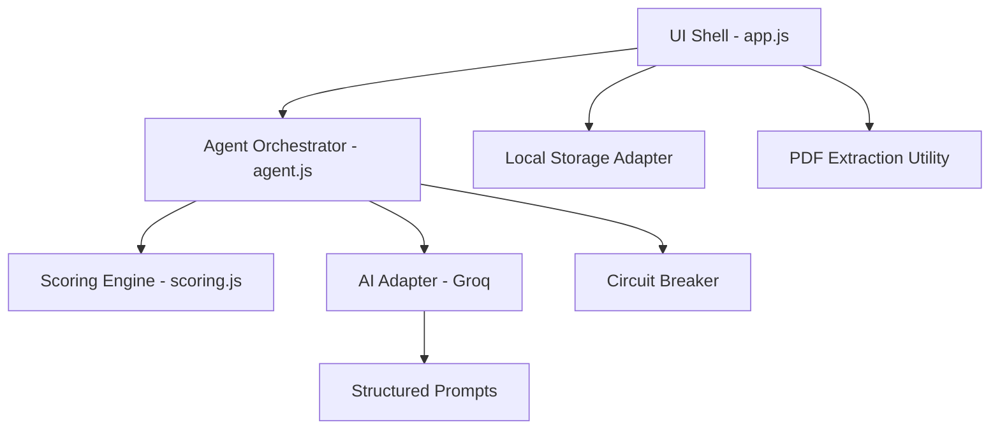

# SkillPilot — Real Proficiency, Not Paper Claims

> **Created by Rahul Sharma for Catalyst - Deccan AI Hackathon**

**SkillPilot** is an autonomous, conversational agent designed to bridge the gap between "resume claims" and "real-world proficiency." By analyzing a Job Description and a candidate's resume, the agent probes each skill with adaptive, scenario-based questions to map real gaps and generate a personalized learning roadmap.

## 🚀 The Problem
Resumes are noisy. Traditional ATS systems filter by keywords, but keywords don't equal competence. Hiring managers waste hours interviewing candidates who "look good on paper" but fail on practical application. Candidates, on the other hand, don't know exactly *what* they are missing to land their dream job.

## 🛠️ The Solution
A decoupled, local-first AI agent that:
1.  **Extracts** critical skills from a Job Description.
2.  **Analyzes** the candidate's resume for existing evidence.
3.  **Probes** with adaptive questions (if an answer is weak, it digs deeper).
4.  **Scores** based on a robust multi-factor logic engine.
5.  **Roadmaps** the exact path to bridge identified skill gaps.

## 🏗️ Architecture

The project follows the **Sovereign Intelligence Protocol (v1.1)**, ensuring a stack-agnostic, modular, and resilient codebase.

### Core Components:
-   **Logic Layer:** Isolated in `src/core/logic/`. Zero DOM access.
-   **Adapters:** Decoupled interfaces for AI providers and storage.
-   **Resilience:** Integrated Circuit Breaker to handle API rate limits and network failures.
-   **Security:** Local-first privacy. API keys and PII never touch a server (other than the inference provider).

## 🧠 Intelligence Core: Adaptive Probing
Unlike static quizzes, **SkillPilot** uses **Adaptive Probing**:
-   **Phase 1 (Opener):** Asks a high-level scenario question.
-   **Phase 2 (Evaluation):** The Scoring Engine evaluates the answer's depth.
-   **Phase 3 (The Fork):**
    -   *If Strong:* Move to the next skill (UX speed).
    -   *If Weak/Partial:* Trigger an **Adaptive Probe** to find the boundary of the candidate's knowledge.

## 🛠️ Tech Stack
-   **Frontend:** Vanilla HTML5, CSS3 (Syne & DM Mono fonts).
-   **Intelligence:** Groq Llama 3.3 (70B) for high-speed, high-reasoning inference.
-   **Parsing:** PDF.js for client-side resume processing.
-   **Logic:** Decoupled Javascript (ES6 Modules).
-   **AI:** Claude, Gemini
## 🚦 Getting Started
1.  **Obtain a Key:** Get a free Groq API key at [console.groq.com](https://console.groq.com).
2.  **Open Index:** Open `index.html` in any modern browser.
3.  **Analyse:** Paste a JD and upload your resume.
4.  **Verify:** Run `RunTests()` in the console to verify system integrity.

## 🛡️ Sovereign Principles
-   **Zero Backend:** 100% client-side compute.
-   **Portable:** Business logic can be moved to Rust, Go, or Swift with zero rewrites.
-   **Surgical UI:** Code logic and UI are strictly separated by a clean interface.

---
<<<<<<< Updated upstream
*Built for the [Catalyst - Deccan AI] — Focused on Technical Integrity and User Centricity.*
=======
*Built for the Catalyst - Deccan AI Hackathon — Focused on Technical Integrity and User Centricity.*
>>>>>>> Stashed changes
